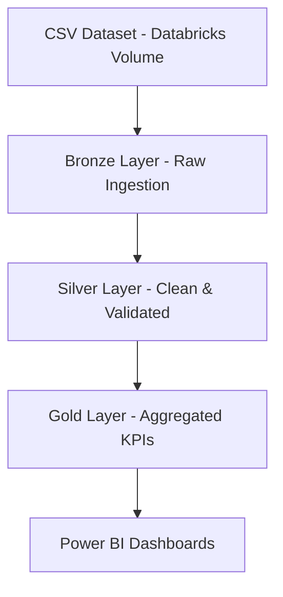

# 📊 Population Census & Demographic Insights Analytics System

[](https://opensource.org/licenses/MIT)
[](https://www.python.org/)
[](https://databricks.com/)
[](https://airflow.apache.org/)

An end-to-end data engineering and analytics project that processes population census data using a modern **Lakehouse architecture** (Bronze–Silver–Gold), orchestrated with **Apache Airflow**, processed on **Databricks**, and visualized using **Power BI**.

---

## 📌 Project Overview

Government agencies and policy organizations rely on census data to make informed decisions on education, employment, infrastructure, and social welfare. However, census data is often large, fragmented, and difficult to analyze efficiently.

This project solves that problem by building a **scalable, automated analytics pipeline** that:

- ✅ Ingests raw census data
- ✅ Cleans and validates records
- ✅ Produces analytics-ready datasets
- ✅ Visualizes demographic insights for decision-makers

---

## 🎯 Objectives

- Build an **enterprise-grade ETL pipeline**
- Implement **Bronze → Silver → Gold** data layers using Delta Lake
- Automate workflows using **Apache Airflow**
- Enable **Power BI dashboards** for policy insights
- Demonstrate real-world data engineering best practices

---

## 🏗️ Architecture Overview



**Architecture Flow:**

```
CSV Dataset (Databricks Volume)
        ↓
Bronze Layer (Raw Ingestion)
        ↓
Silver Layer (Clean & Validated)
        ↓
Gold Layer (Aggregated KPIs)
        ↓
Power BI Dashboards
```

---

## 🧰 Technology Stack

### Data Processing
- **Python** - Core scripting language
- **PySpark** - Distributed data processing
- **Delta Lake** - ACID transactions and versioning

### Big Data Platform
- **Databricks** - Unified analytics platform

### Orchestration
- **Apache Airflow** - Workflow automation (Docker-based)

### Storage
- **Databricks Volumes** - Cloud storage integration
- **Delta Tables** - Optimized lakehouse storage format

### Visualization
- **Power BI** - Interactive dashboards (Import Mode)

### DevOps
- **Docker & Docker Compose** - Containerization
- **Git & GitHub** - Version control

---

## 📁 Project Structure

```
📦 Population-Census-Demographic-Analytics
│
├── 📂 airflow/
│   ├── 📂 dags/
│   │   └── census_databricks_etl.py       # Main DAG orchestration
│   ├── docker-compose.yml                  # Airflow setup
│   └── 📂 logs/                            # Execution logs
│
├── 📂 dataset/
│   └── census_sample_5000_records.csv      # Sample census data
│
├── 📂 etl_pipeline/
│   ├── bronze_ingestion.py                 # Raw data ingestion
│   ├── silver_transformation.py            # Data cleaning & validation
│   └── gold_analytics.py                   # Analytics aggregation
│
├── 📂 notebooks/
│   ├── 01_bronze_ingestion.ipynb           # Bronze layer notebook
│   ├── 02_silver_transformation.ipynb      # Silver layer notebook
│   └── 03_gold_analytics.ipynb             # Gold layer notebook
│
├── 📂 output/
│   └── 📂 gold_tables_preview/             # Preview of analytics tables
│
├── 📂 dashboard/
│   └── census_analytics_dashboard.pbix     # Power BI dashboard file
│
└── README.md                                # Project documentation
```

---

## 📊 Dataset Description

The census dataset contains comprehensive demographic information:

| Column | Description |
|--------|-------------|
| **Region** | Geographic region identifier |
| **Year** | Census year |
| **Age Group** | Population age categories |
| **Gender** | Gender classification |
| **Ethnic Group** | Ethnic classification |
| **Population Count** | Total population |
| **Literacy Rate (%)** | Percentage of literate population |
| **Employed Population** | Number of employed individuals |
| **Employment Rate (%)** | Percentage of employed population |

---

## 🔹 Data Layers

### 🥉 Bronze Layer (Raw Data)

**Purpose:** Immutable raw data storage

- Ingests CSV data from Databricks Volumes
- Applies strict schema enforcement
- Adds audit columns (ingestion timestamp, source path)
- Stores data as immutable Delta tables
- **Table:** `bronze.census_raw`

### 🥈 Silver Layer (Clean & Validated)

**Purpose:** Curated, cleaned, and validated data

- Standardizes categorical values
- Filters invalid records
- Validates numeric ranges
- Prepares analytics-ready datasets
- **Table:** `silver.census_clean`

### 🥇 Gold Layer (Analytics)

**Purpose:** Business-ready aggregated metrics

- Aggregates population metrics
- Computes literacy and employment indicators
- Optimized for BI consumption
- Serves as the single source of truth for dashboards
- **Tables:** 
  - `gold.population_summary`
  - `gold.literacy_metrics`
  - `gold.employment_metrics`

---

## 📈 Power BI Dashboards

### Dashboards Included

#### 1️⃣ Executive Overview
- Total population
- Average literacy rate
- Average employment rate
- Regional comparisons

#### 2️⃣ Gender Demographics
- Gender distribution by region
- Gender trends over years

#### 3️⃣ Age Group Analytics
- Population by age group
- Workforce and dependency analysis

#### 4️⃣ Literacy Analysis
- Literacy rates by region
- Literacy trends over time

#### 5️⃣ Employment Insights
- Employment rate by region
- Employment trends

#### 6️⃣ Regional Comparison
- Side-by-side demographic KPIs

---

## ⚙️ ETL Orchestration with Airflow

### Key Features

- ✅ Airflow DAG triggers Databricks Jobs
- ✅ Supports retries, logging, and monitoring
- ✅ Logs are persisted locally using Docker volumes
- ✅ Fully reproducible environment using Docker Compose

### DAG Structure

```python
census_databricks_etl
│
├── bronze_ingestion_task
│   ↓
├── silver_transformation_task
│   ↓
└── gold_analytics_task
```

---

## 🧪 Data Quality & Validation

- ✅ Schema enforcement at ingestion
- ✅ Range validation for numeric fields
- ✅ Filtering of invalid demographic records
- ✅ Clear separation of raw vs curated data
- ✅ Automated data quality checks

---

## 🔐 Security & Reliability

- 🔒 Role-based access control in Airflow
- 🔑 Token-based authentication for Databricks
- 🔄 Fault-tolerant pipeline with retries
- 📝 Audit-friendly logging
- 🛡️ Data lineage tracking

---

## 🚀 How to Run the Project

### Prerequisites

- Docker & Docker Compose installed
- Databricks workspace access
- Power BI Desktop (for dashboard viewing)
- Python 3.8+

### Step-by-Step Guide

#### 1️⃣ Clone the Repository

```bash
git clone https://github.com/yourusername/Population-Census-Demographic-Analytics.git
cd Population-Census-Demographic-Analytics
```

#### 2️⃣ Start Airflow

```bash
cd airflow
docker compose up -d
```

#### 3️⃣ Access Airflow UI

Open your browser and navigate to:

```
http://localhost:8080
```

**Login Credentials:**
- **Username:** `admin`
- **Password:** `admin`

#### 4️⃣ Configure Databricks Connection

1. Navigate to **Admin → Connections** in Airflow UI
2. Add Databricks connection with your credentials

#### 5️⃣ Trigger the ETL Pipeline

1. Enable the `census_databricks_etl` DAG
2. Click "Trigger DAG" to start execution
3. Monitor progress in the Airflow UI
4. Check logs in `airflow/logs/` folder

#### 6️⃣ View Power BI Dashboard

1. Open `dashboard/census_analytics_dashboard.pbix`
2. Refresh data connection to Databricks
3. Explore the interactive dashboards

---

## 📊 Sample Queries

### Bronze Layer - Raw Data Count

```sql
SELECT COUNT(*) as total_records 
FROM bronze.census_raw;
```

### Silver Layer - Clean Population by Region

```sql
SELECT region, SUM(population_count) as total_population
FROM silver.census_clean
GROUP BY region
ORDER BY total_population DESC;
```

### Gold Layer - Literacy Trends

```sql
SELECT year, AVG(literacy_rate) as avg_literacy
FROM gold.literacy_metrics
GROUP BY year
ORDER BY year;
```

---

## 📌 Key Learnings

- ✅ Implemented enterprise-grade **Lakehouse architecture**
- ✅ Understood **schema enforcement** and data quality validation
- ✅ Gained hands-on experience with **Airflow orchestration**
- ✅ Built **BI-ready analytics pipelines**
- ✅ Practiced real-world debugging and pipeline recovery
- ✅ Mastered **Delta Lake** for ACID transactions
- ✅ Created production-ready **Power BI dashboards**

---

## 🛠️ Troubleshooting

### Common Issues

#### Airflow won't start
```bash
docker compose down
docker compose up -d --build
```

#### Databricks connection fails
- Verify token is valid
- Check workspace URL format
- Ensure network connectivity

#### Power BI data refresh issues
- Confirm Delta tables exist in Databricks
- Verify connection credentials
- Check data source settings

---

## 🔮 Future Enhancements

- [ ] Add real-time streaming with Kafka
- [ ] Implement machine learning predictions
- [ ] Add data drift monitoring
- [ ] Create automated data quality reports
- [ ] Deploy to cloud (AWS/Azure/GCP)
- [ ] Add CI/CD pipeline with GitHub Actions

---

## 📄 License

This project is licensed under the MIT License - see the [LICENSE](LICENSE) file for details.

---

## 👨‍💻 Author

**Sreejith**  
*Capstone Project – Data Engineering & Analytics*

[](https://linkedin.com/in/yourprofile)
[](https://github.com/yourusername)
